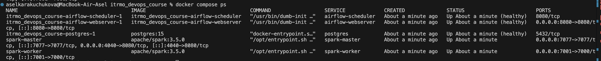
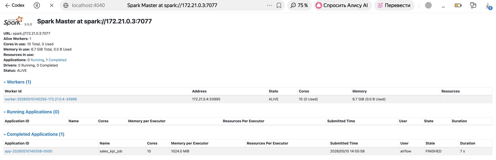

# Лабораторная работа №2
## Тема: Airflow + Spark

## 1. Цель работы
Подключить Apache Airflow к Apache Spark и выполнить Spark-задачу из DAG через `SparkSubmitOperator`.

## 2. Содержимое репозитория
- `Dockerfile` — кастомный образ Airflow с зависимостями для Spark.
- `docker-compose.yml` — сервисы Airflow, PostgreSQL, Spark master/worker.
- `dags/spark_sales_pipeline.py` — DAG для запуска Spark-задачи.
- `spark/sales_kpi_job.py` — PySpark-скрипт (SparkSession).
- `CHANGES.md` — изменения относительно ЛР1.
- `screenshots/` — скриншоты для отчётности.

## 3. Выполнение требований ЛР2
### 3.1 Dockerfile
- Базовый образ: `apache/airflow:2.7.1`.
- `WORKDIR`: `/opt/airflow`.
- Под `USER root` установлены системные пакеты `procps` и `default-jre`.
- Возврат на `USER airflow` для корректной работы Airflow.
- Установлены зависимости:
  - `apache-airflow-providers-apache-spark==4.1.1`
  - `pyspark==3.5.0`
- Папка `spark` копируется в образ: `/opt/airflow/spark`.

### 3.2 Docker Compose
- Добавлены сервисы:
  - `spark-master` (`container_name: spark-master`)
  - `spark-worker` (`container_name: spark-worker`)
- Для Airflow добавлено монтирование:
  - `./spark:/opt/airflow/spark`
- Выстроена очередность деплоя через `depends_on`:
  - `postgres -> spark-master -> spark-worker -> airflow-init -> airflow-webserver/airflow-scheduler`

### 3.3 DAG и Spark-job
- DAG `spark_sales_pipeline` использует `SparkSubmitOperator`.
- Приложение запускается по пути `/opt/airflow/spark/sales_kpi_job.py`.
- В `spark/sales_kpi_job.py` используется `SparkSession` и расчёт KPI по продажам.

## 4. Запуск
```bash
docker compose up -d --build
```

## 5. Настройка Spark Connection в Airflow
В Airflow UI: `Admin -> Connections -> +`.

Параметры подключения:
- Connection Id: `spark_local`
- Connection Type: `Spark`
- Host: `spark://spark-master`
- Port: `7077`

## 6. Проверка выполнения
1. Проверить контейнеры:
```bash
docker compose ps
```

2. Проверить, что DAG загружен:
```bash
docker compose exec -T airflow-webserver airflow dags list | grep spark_sales_pipeline
```

3. Запустить DAG `spark_sales_pipeline` в Airflow UI:
- `http://localhost:8080`

4. Проверить Spark UI:
- `http://localhost:4040`
- Должны быть видны `worker` и выполненная задача.

## 7. Примечание по порту worker
Во внешнем пробросе используется `7001:7000`.

## 8. Скриншоты ЛР2
1. Статус контейнеров после запуска:



2. Spark UI (master/worker и выполненные задачи):


