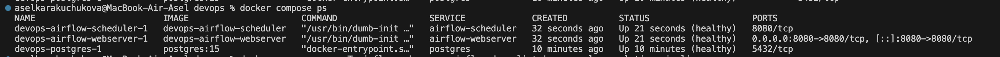
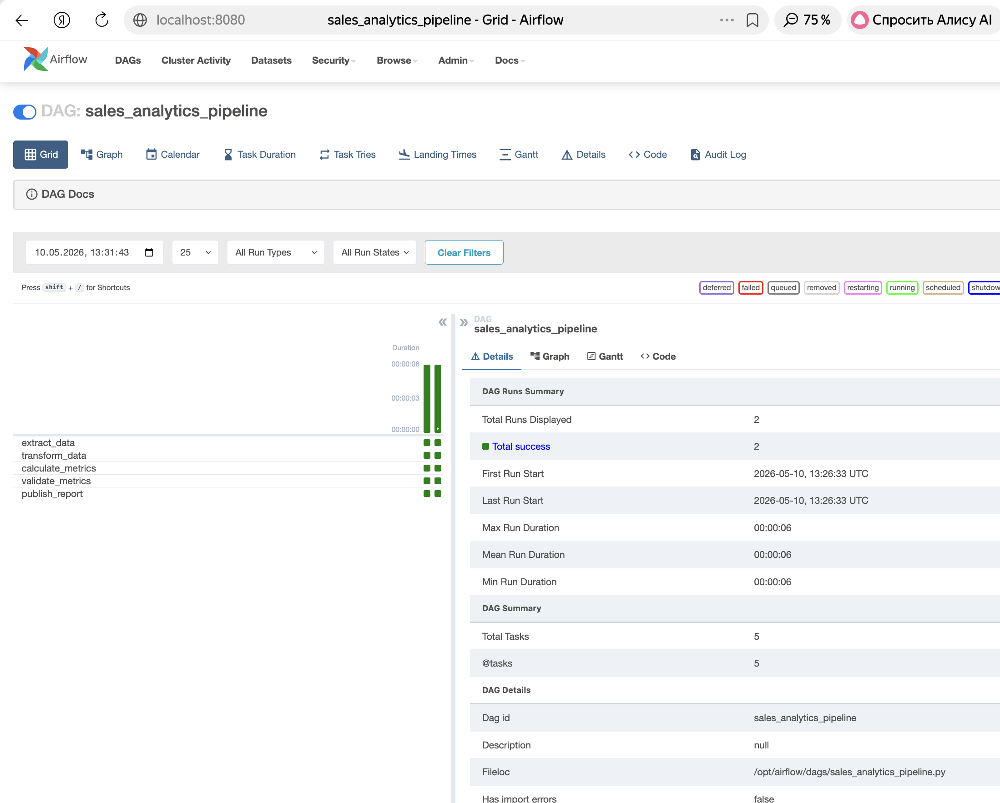

# Лабораторная работа №1
## Тема: Airflow + Docker Compose

## Цель
Развернуть Apache Airflow в Docker Compose и реализовать DAG.

## Состав
- `Dockerfile`
- `docker-compose.yml`
- `dags/sales_analytics_pipeline.py`
- `CHANGES.md`
- `screenshots/`

## Ключевые требования
- Базовый образ: `apache/airflow:2.7.1`
- Executor: `LocalExecutor`
- Оставлены сервисы: `airflow-webserver`, `airflow-scheduler`, `airflow-init`, `postgres`
- Отключены: `redis`, `airflow-worker`, `airflow-triggerer`, `airflow-cli`, `flower`

## Запуск
```bash
docker compose up -d --build
```

## Проверка
```bash
docker compose ps
docker compose exec -T airflow-webserver airflow dags list | grep sales_analytics_pipeline
```

## Airflow UI
- URL: `http://localhost:8080`
- По умолчанию авторизация: `airflow / airflow`

## Скриншоты



